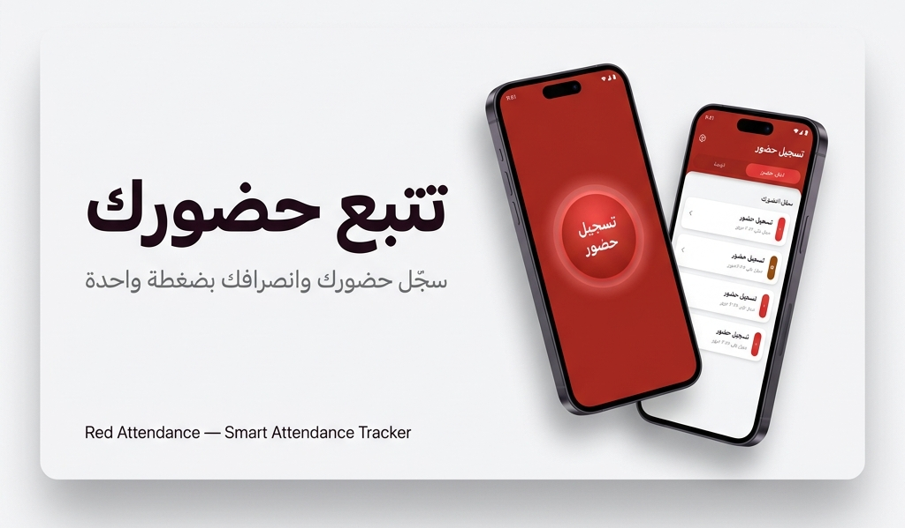

<div align="center">




```text
█████╗ ████████╗████████╗███████╗███╗   ██╗██████╗  █████╗ ███╗   ██╗ ██████╗ ███████╗
██╔══██╗╚══██╔══╝╚══██╔══╝██╔════╝████╗  ██║██╔══██╗██╔══██╗████╗  ██║██╔════╝ ██╔════╝
███████║   ██║      ██║   █████╗  ██╔██╗ ██║██║  ██║███████║██╔██╗ ██║██║      █████╗  
██╔══██║   ██║      ██║   ██╔══╝  ██║╚██╗██║██║  ██║██╔══██║██║╚██╗██║██║      ██╔══╝  
██║  ██║   ██║      ██║   ███████╗██║ ╚████║██████╔╝██║  ██║██║ ╚████║╚██████╗ ███████╗
╚═╝  ╚═╝   ╚═╝      ╚═╝   ╚══════╝╚═╝  ╚═══╝╚═════╝ ╚═╝  ╚═╝╚═╝  ╚═══╝ ╚═════╝ ╚══════╝
```

# App Tracker Attendance

**Production-Ready Personal Attendance Tracker**  
Arabic-first Flutter application for accurate attendance, local durability, and professional reporting.


<br />


</div>

---

## Table of Contents

- [Overview](#overview)
- [Core Features](#core-features)
- [Architecture](#architecture)
- [Tech Stack](#tech-stack)
- [Database Schema](#database-schema)
- [Project Structure](#project-structure)
- [Setup and Run](#setup-and-run)
- [Export System](#export-system)
- [Quality and Production Notes](#quality-and-production-notes)
- [Roadmap](#roadmap)
- [License](#license)

---

## Overview

`App Tracker Attendance` is a complete attendance workflow system built for real daily use.

It provides:

- Live digital time + date experience on the home screen
- Reliable clock-in / clock-out workflow
- Persisted active session across app restarts and RAM kills
- Manual correction for past records
- Monthly reporting with smart row coloring rules
- One-tap export to CSV and professional RTL Arabic PDF

The implementation follows clean layering and modular organization for maintainability and scaling.

---

## Core Features

### 1) Attendance Session Engine

- Center action button with two modes:
  - Idle: green gradient, `تسجيل حضور`
  - Active: red/orange gradient, `تسجيل انصراف`
- Active mode pulse animation via `avatar_glow`
- Live stopwatch (`HH:MM:SS`) while the session is active

### 2) Resilient State Persistence

- Active `clock_in` stored in `shared_preferences`
- Session recovery logic after restart:
  - Restore saved timestamp
  - Recompute elapsed time dynamically with `DateTime.now().difference(savedClockIn)`
- No background isolates used for timer tracking

### 3) History and Manual Edit

- Complete attendance records list
- Tap any record to edit:
  - `clock_in`
  - `clock_out`
  - `notes`
- Add missed/past day using FAB
- Delete record support

### 4) Monthly Report Preview

- `DataTable` columns:
  - `الملاحظات`
  - `وقت الانصراف`
  - `وقت الحضور`
  - `التاريخ`
  - `اليوم`
- Dynamic row coloring rules:
  - Friday (`الجمعة`) -> light yellow
  - Notes containing `غياب` or `اجازة` or `اذن` -> light red

### 5) Export Features

- CSV export for Excel workflows
- PDF export with RTL Arabic formatting and branded header:
  - `سجل الحضور والانصراف - محمد حامد | Codly`
- Share flow using native share sheet

---

## Architecture

Pattern used:

`UI -> Provider -> Repository -> Database`

### Layers

- `UI`: Presentation and user interaction
- `Provider`: Business/state logic and reactive updates
- `Repository`: Data access abstraction
- `Database`: `sqflite` schema + persistence
- `Utils`: date formatting, export, row-color rules

This setup keeps features testable, readable, and expandable.

---

## Tech Stack

| Technology | Purpose |
|---|---|
| Flutter (Material 3) | UI framework |
| Provider | State management |
| sqflite | Local persistent database |
| shared_preferences | Active clock-in persistence |
| intl | Date/time formatting |
| avatar_glow | Active pulse animation |
| csv | CSV file generation |
| pdf + printing | PDF generation (RTL Arabic) |
| path_provider | Temporary file storage |
| share_plus | File sharing |
| path | DB path management |

---

## Database Schema

Table: `attendance`

| Column | Type | Notes |
|---|---|---|
| id | INTEGER | Primary key, autoincrement |
| date | TEXT | `YYYY-MM-DD` |
| day_name | TEXT | Arabic day name |
| clock_in | TEXT | ISO DateTime |
| clock_out | TEXT | ISO DateTime |
| notes | TEXT | Manual notes (`غياب`, `اذن`, `تأخير`, etc.) |

---

## Project Structure

```text
lib/
  core/
    app_theme.dart
  data/
    database/
      app_database.dart
    repositories/
      attendance_repository.dart
  models/
    attendance_record.dart
  providers/
    attendance_provider.dart
  ui/
    shell/
      main_navigation_screen.dart
    home/
      home_tab.dart
    history/
      history_tab.dart
      record_editor_screen.dart
    report/
      report_tab.dart
  utils/
    attendance_row_color.dart
    date_utils_ar.dart
    export_service.dart
  main.dart

test/
  widget_test.dart
```

---

## Setup and Run

### Prerequisites

- Flutter SDK 3.x+
- Dart 3.x+
- Android Studio / VS Code
- Android Emulator or physical device

### Installation

```bash
flutter pub get
```

### Run

```bash
flutter run
```

### Static Analysis

```bash
flutter analyze
```

### Tests

```bash
flutter test
```

---

## Export System

### CSV

- Build rows from current month records
- Convert with `ListToCsvConverter`
- Save to temporary directory
- Share as attachment via `share_plus`

### PDF

- Build RTL Arabic document via `pdf` package
- Use Cairo Google font (`PdfGoogleFonts.cairo*`)
- Apply row background colors using same report logic
- Export and share through native share dialog

---

## Quality and Production Notes

- Offline-first architecture
- No session loss after process restarts
- Stable modular file layout
- Clear separation of concerns
- Analyzer clean (`No issues found`)

---

## Roadmap

- Overtime and late-policy rule engine
- Advanced monthly analytics
- Multi-profile attendance tracking
- Signed and archived PDF reports

---

<div align="center">

Built with Flutter for high-quality Arabic-first attendance workflows.

</div>
